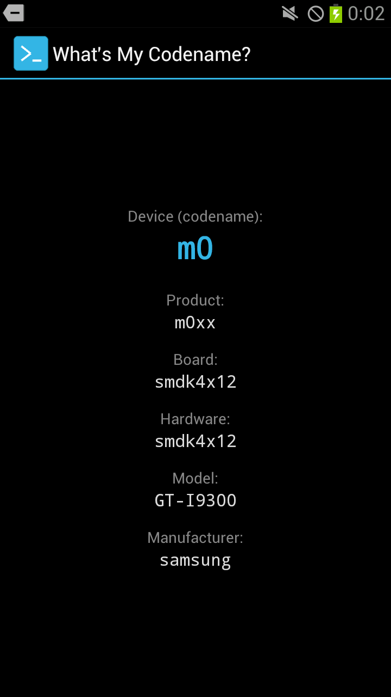

# What's My Codename?

[English](README.md) | **Русский**

Простая утилита, которая показывает кодовое имя вашего старого Android-устройства (например, i9100, i9300, jflte, maguro, mako, hammerhead) и связанные значения.

<p align="center">
  
</p>

## Скачать

Файл `whatsmycodename.apk` лежит в [последнем релизе](https://github.com/suburager/whatsmycodename/releases/latest). Работает на Android 1.5 и новее.

## Сборка

Нужны: JDK 21, Android SDK (platform 34, build-tools 34.0.0), Gradle 8.10.2.

Создайте `local.properties` в корне проекта:

```
sdk.dir=/путь/к/android-sdk
```

Затем выполните:

```
gradle assembleDebug
```

APK появится в `app/build/outputs/apk/debug/app-debug.apk`.

## Лицензия

[MIT](LICENSE)
